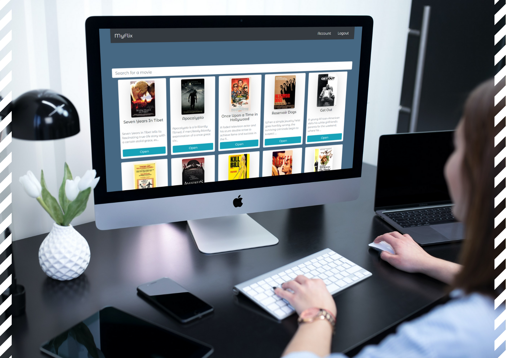

# React App (myFlix)

<p align="center">
  
  </p>
  
## Objective

Using React, build the client-side for an application called myFlix based on its existing
server-side code (REST API and database).

### View it live [HERE](https://myflix-haleh.netlify.app/)

## User Stories

● As a user, I want to be able to access information on movies, directors, and genres so
that I can learn more about movies I’ve watched or am interested in.

● As a user, I want to be able to create a profile so I can save data about my favorite
movies.

## Technologies:

- React
- npm
- Parcel
- Babel
- React Redux
- Bootstrap

## Key Features:

- **Main View**
  - Returns list of all movies to user
  - Search function actively filters through movies
  - Ability to select movie for more details
  - Options for users to log out or view profile information
- **Movie View**
  - Returns data about a single movie to user
  - Allows users to add movie to list of favorites
- **Login View**
  - Allows existing users to login
- **Registration View**
  - Allows new users to create a profile
- **Genre View**
  - Returns data about a specific genre
  - Displays example movies of the same genre
- **Director View**
  - Returns data about a specific director
  - Displays example movies directed by the same director
- **Profile View**
  - Allows users to view and update user information
  - Allows users to deregister
  - Displays list of favorite movies
  - Allows users to remove movies from favorites

## Getting Started

To run this project locally:
install dependencies

```
npm install
```

build for development

```
parcel [path to index.html]
```

open the application in browser on port 1234 (or port number stated in terminal)

```
https://localhost:1234/
```

## Deployment

[](https://app.netlify.com/sites/myflix-haleh/deploys)
